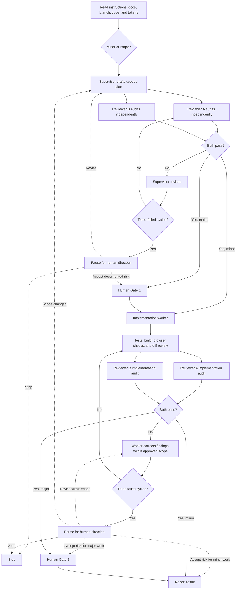

# UI Orchestrator Skill Design

**Status:** Approved for implementation planning
**Date:** 2026-08-04
**Repository branch:** `skill-ui-orchestrators`

## Objective

Create a reusable UI orchestration skill and a PetroHydroPipe project profile that coordinate Superpowers workflows, `ui-ux-pro-max`, two independent reviewers, and human approval for major UI work.

The orchestration must improve design quality without changing product meaning, inventing system capabilities, weakening functionality, or allowing major UI work directly on `main`.

## Deliverables

| Skill | Location | Responsibility |
|---|---|---|
| `ui-orchestrator` | `C:\Users\Karl Joseph Laroa\.codex\skills\ui-orchestrator\` | Reusable workflow, role definitions, review protocol, gates, and safety rules |
| `petro-ui-orchestrator` | `.agents/skills/petro-ui-orchestrator/` | PetroHydroPipe triggers, repository constraints, product scope, and project verification requirements |

The global skill is the workflow source of truth. The project profile references it and contains only repository-specific constraints so the two installations do not duplicate and drift.

## Naming

- Skill identifiers and folder names use lowercase kebab case: `ui-orchestrator` and `petro-ui-orchestrator`.
- Display titles may use `UI Orchestrator` and `Petro UI Orchestrator`.

## Trigger Scope

Trigger for work involving:

- UI or UX design and implementation
- Layout, spacing, typography, color, or styling
- Components and design systems
- Visual audits and consistency reviews
- Accessibility and keyboard interaction
- Responsive behavior
- Frontend interaction design

Do not trigger for backend-only or documentation-only work unless UI behavior is directly affected.

## Architecture and Roles

Skills provide instructions; the root agent performs orchestration through the available agent-collaboration tools. For every UI task, the supervisor must spawn two independent reviewer agents. After plan approval, it must use a separate implementation worker guided by `ui-ux-pro-max`.

| Role | Responsibility |
|---|---|
| Supervisor | Uses the appropriate Superpowers workflow, inspects context, classifies risk, creates and revises the plan, manages gates, and reports evidence |
| Reviewer A | Independently evaluates UX, visual consistency, accessibility, and responsive behavior |
| Reviewer B | Independently evaluates feasibility, regressions, dependencies, performance, project alignment, and scope |
| Implementation worker | Uses `ui-ux-pro-max` to implement the unanimously approved plan, or a plan explicitly authorized by the human after the three-cycle limit |
| Human | Approves major plans and completed major work; resolves disagreement after the revision limit |

Reviewer agents should be retained or reused across stages. Plan reviewers finish before implementation begins, allowing one worker to run without exceeding the four-agent concurrency limit.

## Workflow



### Entry checks

Before planning:

1. Read active system, repository, and `AGENTS.md` instructions.
2. Inspect the current branch, status, and overlapping uncommitted work.
3. Read relevant PRD, TDD, architecture, design guidance, and accepted corrections.
4. Inspect the current implementation, shared components, and design tokens.
5. Identify functionality and data contracts that must remain unchanged.

### Source priority

Resolve design guidance in this order:

1. Active system, repository, and `AGENTS.md` instructions
2. Explicit human requirements and approved decisions
3. Approved plan or design specification
4. PRD, TDD, architecture, and current implementation
5. Existing components and design tokens
6. General `ui-ux-pro-max` recommendations

Material conflicts between documentation and implementation require a human decision. Do not silently choose one source.

## Change Classification

| Minor UI work | Major UI work |
|---|---|
| Localized and readily reversible | Changes global styling or design tokens |
| Affects one component or tightly scoped screen area | Affects navigation, authentication UI, information architecture, or multiple routes |
| Preserves shared architecture and data meaning | Changes dashboard data meaning, API behavior, or backend behavior |
| Adds no dependency | Adds or replaces dependencies, Tailwind, shadcn, fonts, or external assets |
| Does not redesign responsive structure | Substantially rewrites responsive behavior |

When uncertain, classify the work as major.

### Branch policy

- Minor UI work may be performed on `main`.
- Major UI work is prohibited on `main`.
- If major work begins on `main`, create a dedicated `ui-<task-name>` branch before editing.
- If already on a non-main feature branch, verify its status and proceed without creating an unnecessary branch from that branch.
- Preserve unrelated changes. Stop and request direction if they overlap the proposed work.
- Never force-push, delete branches, merge, push, or deploy without explicit authorization.

## Human Gates

### Gate 1: Major plan approval

Request approval only after both reviewers pass the proposed plan. Present:

- Why the task is major
- Proposed files and components
- Protected functions and data contracts
- Dependency or migration impact
- Reviewer verdicts and evidence
- Verification plan and rollback approach

Implementation cannot begin until the human approves.

### Gate 2: Major implementation approval

Request approval only after implementation, verification, and both independent implementation audits pass. Present:

- What changed
- Screens and states verified
- Commands and results
- Browser console and network findings
- Reviewer verdicts
- Remaining risks or deferred issues
- Rollback instructions

Do not commit, merge, push, or deploy the major change until the human approves. Those Git or deployment actions still require explicit authorization.

### Minor work

Minor work may proceed without blocking human gates once both reviewers agree. Report the classification, changes, verification evidence, reviewer verdicts, and residual risks. Commit, merge, push, and deployment still require an explicit user request.

## Review Protocol

Reviewers work independently and must not copy, defer to, or negotiate their verdicts with each other. Each finding requires concrete evidence such as a file and line, screenshot, test output, console message, or reproduced behavior.

### Reviewer A checklist

- Visual hierarchy and consistency
- Existing component and token reuse
- Responsive layouts at 375, 768, 1024, and 1440 pixels
- Keyboard navigation and visible focus states
- Minimum 4.5:1 contrast for normal text
- Touch targets near 44 by 44 pixels
- Reduced-motion support
- No status communicated by color alone

### Reviewer B checklist

- Approved requirements and PRD/TDD alignment
- Functional regression risks
- API and data-contract integrity
- Dependency, bundle-size, and performance impact
- Branch and scope compliance
- Test, build, and browser evidence
- Unrelated code or design drift

### Verdicts

| Verdict | Meaning |
|---|---|
| `PASS` | No blocking issue remains |
| `REVISE` | One or more blocking findings must be corrected |
| `HUMAN DECISION` | Requirements conflict or the correct resolution requires product authority |

### Severity

| Severity | Disposition |
|---|---|
| `BLOCKER` | Mandatory correction before progress |
| `MAJOR` | Mandatory correction before progress |
| `MINOR` | Fix when reasonably in scope; otherwise disclose for human review |
| `SUGGESTION` | Non-blocking improvement |

Normal progression requires two independent `PASS` verdicts. One rejection is enough to require revision. Only an explicit human decision after the three-cycle limit may accept a documented unresolved risk.

### Disagreement limit

The supervisor may run at most three review-and-revision cycles for a stage. If unanimous `PASS` verdicts are still not reached, the assistant summarizes:

- Each disputed finding
- Supporting evidence
- Attempted resolutions
- Tradeoffs of the remaining options
- A recommended path, clearly labeled as advice

The human may require another revision, explicitly accept a documented unresolved risk, or stop the work. The supervisor cannot overrule either reviewer or treat silence as approval.

Implementation corrections that remain inside the approved scope return directly to verification and implementation review. If a correction changes the approved scope, return to planning and repeat Gate 1 for major work.

## Verification Requirements

Verification is proportional to scope and includes, when available:

- Focused tests for affected behavior
- Full relevant frontend tests
- Configured lint or static checks
- Production build
- Final diff review
- Browser checks for layout and interaction
- Console-error inspection
- Failed-request inspection in the network panel
- Keyboard and focus-state checks
- Supported light and dark themes
- Responsive checks at the required widths

Missing browser or testing capability must be disclosed and cannot be represented as a successful check.

## PetroHydroPipe Constraints

The project profile must enforce the current approved scope unless the human explicitly changes it:

- One Spiral Mill machine
- Five inductive proximity sensors
- No invented speed, temperature, pressure, RPM, or line-efficiency telemetry
- No simulated backend capability represented as live functionality
- Backend-dependent gaps are documented rather than faked
- Existing authentication and data contracts remain unchanged during design-only tasks
- PRD, TDD, architecture, and accepted correction documents are reviewed before major UI planning

## Required Run Output

Every orchestration run reports:

1. Task classification and evidence
2. Current branch and branch action
3. Proposed scope and protected functionality
4. Reviewer A verdict and findings
5. Reviewer B verdict and findings
6. Human Gate 1 request when applicable
7. Implementation and verification evidence
8. Post-implementation reviewer verdicts
9. Remaining issues and rollback guidance
10. Human Gate 2 request when applicable

## Limitations

- Do not automatically install packages or replace dependencies.
- Do not perform a broad redesign when a localized correction is sufficient.
- Do not change backend behavior without separate authorization.
- Do not create additional skills during normal UI work.
- Do not invent requirements, telemetry, controls, or data.
- Do not copy the entire `ui-ux-pro-max` knowledge base into either skill.
- Do not use stale screenshots or historical implementation facts as current evidence.
- Do not continue subjective debate beyond three revision cycles.
- Do not silently fall back to a single self-review when independent reviewer agents are unavailable; pause and ask for human direction.

## Skill Package Shape

### Global skill

```text
ui-orchestrator/
├── SKILL.md
├── agents/
│   └── openai.yaml
└── references/
    ├── review-protocol.md
    └── report-templates.md
```

### Project profile

```text
.agents/skills/petro-ui-orchestrator/
├── SKILL.md
├── agents/
│   └── openai.yaml
└── references/
    └── petrohydropipe-constraints.md
```

Scripts and additional documentation are excluded unless implementation proves they are necessary.

## Acceptance Criteria

- Both skill packages pass the Skill Creator validator.
- Trigger descriptions clearly include UI/UX work and exclude backend-only work.
- A dry-run minor task follows independent review without activating human gates.
- A dry-run major task on `main` stops and requires branch creation.
- A dry-run major task on a feature branch reaches Gate 1 only after two passes.
- A rejected plan is revised and re-reviewed.
- A three-cycle failure escalates with evidence and does not self-approve.
- Implementation cannot drift beyond the approved plan.
- Major completed work reaches Gate 2 only after verification and two passes.
- Project constraints prevent invented machine or sensor capabilities.
- Neither skill can auto-commit, merge, push, deploy, or install dependencies.

## Approved Decisions

- Two human gates for major work
- Autonomous minor work after internal unanimous review
- Human resolution after three unsuccessful review cycles
- Reusable global core plus a PetroHydroPipe project profile
- Global name `ui-orchestrator`
- Project name `petro-ui-orchestrator`
- Major UI work must use a non-main branch
- Minor UI work may occur on `main`

## Out of Scope

- Implementing or changing the PetroHydroPipe UI
- Installing Tailwind, shadcn, or other UI libraries
- Changing frontend or backend application behavior
- Merging or publishing the skill branch
- Building a general-purpose software-development orchestrator
